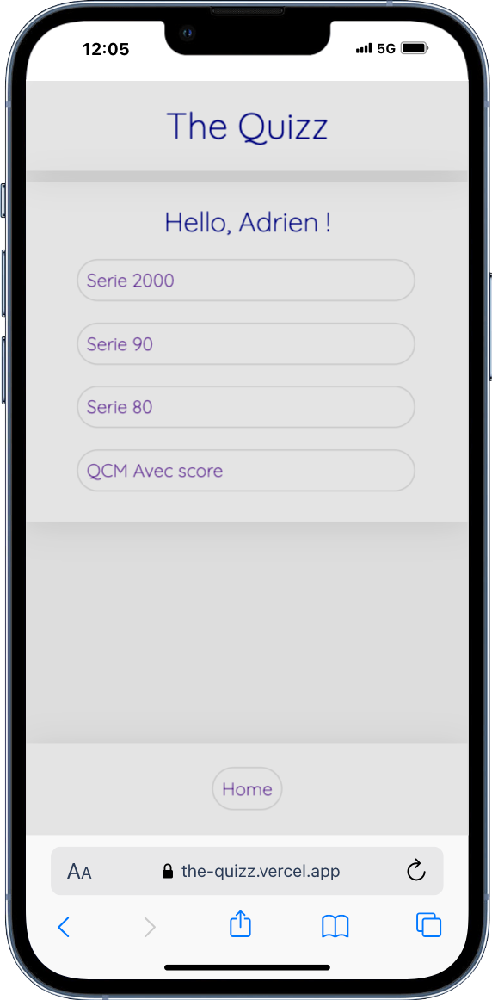
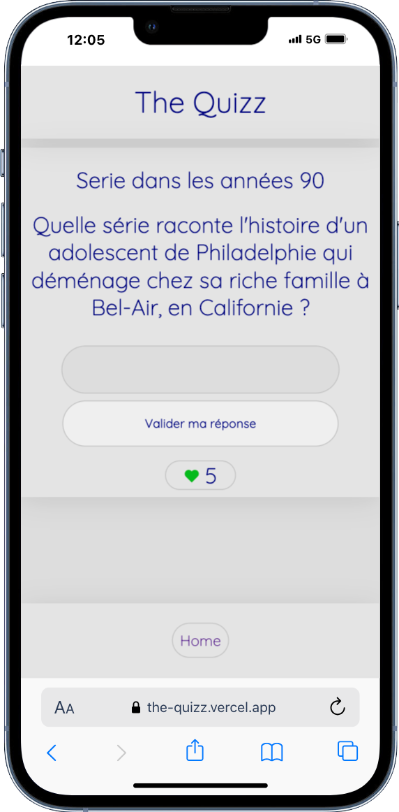
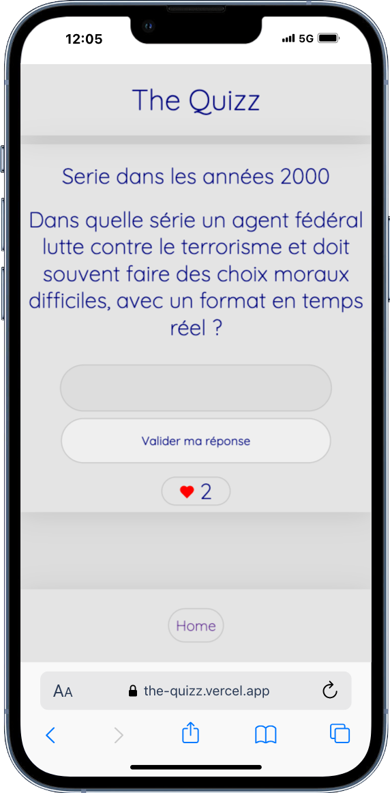

# Projet : The Quizz

### Formation Becode
Projet de développement d'une application web écrite en TypeScript, utilisant React et React Router, et construite avec Vite.

## Application Web Quizz

Création d'un quiz dans le but d'apprendre TypeScript et de mettre en pratique des compétences en développement web.

Le projet **The Quizz** a été développé en suivant une approche mobile first.

## Lien

Découvrez le projet en ligne ici : [The Quizz](https://the-quizz.vercel.app/)

## Image

